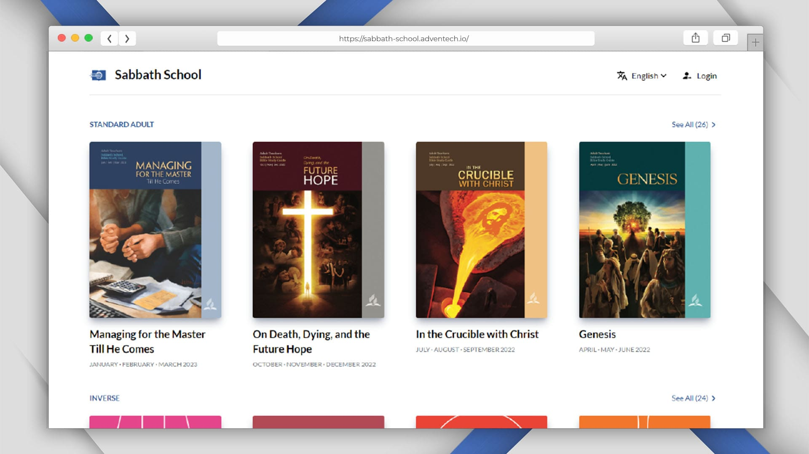

# PersianSDA Sabbath School

[](#)

> This is a web app for the Sabbath School lessons. It is built with [Nuxt 3](https://nuxt.com/). forked from [Adventech/sabbath-school-web](https://github.com/Adventech/sabbath-school-web)

## Getting Started

First, install the dependencies:

```bash
pnpm install
```

then run this command to copy the necessary files:

```bash
pnpm prepare
```

### Development

```bash
pnpm dev
```

### Production

```bash
pnpm build
```

```bash
pnpm postinstall
```

```bash
pnpm preview
```

### Locales

***Locales are translated by Google Translate. so they are not accurate.***

```bash
# will translate and rewrite the locales
pnpm translate
```

## Todo

- [ ] PWA support
- [ ] Convert all option api's to composition api
- [ ] Add global color mode

## Used Stack

- Nuxt
- Pinia
- Vueuse
- Nuxt SEO
- Nuxt I18n
- HeadlessUI
- TailwindCSS

## Contributing

If you have any suggestions or find any bugs, please open an [issue](https://github.com/persiansda/sabbath-school/issues/new) or a pull request.

## License

[MIT License](./LICENSE)
